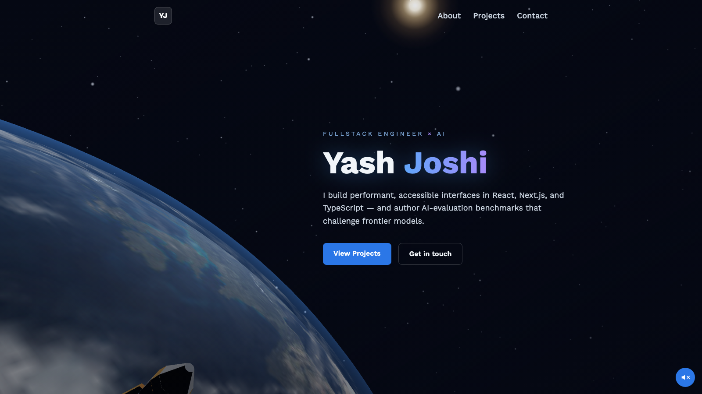

<div align="center">

# Yash Joshi — Portfolio

### A real-time 3D space portfolio — an actual rendered Earth, a synced day/night sun, and a rocket that reaches orbit.

[](https://yashjoshi.in)
&nbsp;
[](https://react.dev)
[](https://threejs.org)
[](https://vite.dev)
[](https://tailwindcss.com)

<a href="https://yashjoshi.in"></a>

</div>

## ✨ Overview

My personal portfolio, rebuilt around a persistent, real-time 3D hero. Instead of a static illustration, the background is a rendered planet you can watch come alive: a rocket launches, becomes an orbiting satellite, and the sun rises from behind the Earth, arcs across the sky, and sets — with the day/night terminator, city lights, and atmosphere all staying in sync with it.

It's built to *demonstrate* the things a portfolio usually just claims: performance, accessibility, and attention to craft.

## 🌍 Highlights

- **Real Earth, not a texture-on-a-ball** — NASA Blue Marble day map, ocean specular, a drifting cloud layer, and a night-lights map.
- **Synced day/night** — a custom `onBeforeCompile` GLSL patch masks the **city lights to the night side** only, driven by the live sun direction.
- **Atmosphere shader** — cool-blue day limb with a warm **sunrise band at the terminator**.
- **A sun that behaves like a sun** — a distant, soft sprite on one big path: it emerges from behind the planet, sweeps across the sky, fades out past the right edge, and loops back — never popping in from the wrong side. The key light is derived from its position, so lighting always matches.
- **Rocket → satellite** — a launch on load that transforms into a limb-hugging orbit.
- **Liquid-glass UI** — translucent, backdrop-blurred project cards with a subtle sheen.
- **Background music toggle** — accessible, opt-in, persists across routes.

## ♿ Accessibility & 🚀 Performance

- Fully **keyboard-operable** and **screen-reader friendly**: skip link, landmarks, labelled nav, `aria` on interactive controls, decorative visuals hidden from AT.
- **WCAG-contrast** checked text; honours **`prefers-reduced-motion`** for UI transitions.
- Perf-minded 3D: capped device pixel ratio, GPU/compositor-crash hardening, imperatively-loaded textures (no Suspense stalls), and trimmed dependencies/assets.

## 🛠️ Tech Stack

| Area | Tools |
| --- | --- |
| Framework | **React 19**, React Router 7 |
| 3D / graphics | **Three.js (r185)**, @react-three/fiber 9, @react-three/drei 10, custom GLSL |
| Build | **Vite 8**, @vitejs/plugin-react |
| Styling | **Tailwind CSS 3**, PostCSS |
| Extras | react-vertical-timeline-component, EmailJS |
| Tooling | ESLint, Prettier |

## 🚀 Getting Started

> **Requires Node ≥ 22** (a transitive 3D dependency needs it). Uses **Yarn**.

```bash
# install
yarn install

# start the dev server (http://localhost:5173)
yarn dev

# production build + preview
yarn build
yarn preview

# lint
yarn lint
```

To enable the contact form, add an `.env` with your EmailJS keys:

```bash
VITE_APP_EMAILJS_SERVICE_ID=...
VITE_APP_EMAILJS_TEMPLATE_ID=...
VITE_APP_EMAILJS_PUBLIC_KEY=...
```

## 📁 Structure

```
src/
├─ components/
│  ├─ OrbitScene.jsx     # the 3D hero: Earth, sun, atmosphere, rocket → satellite
│  ├─ MusicToggle.jsx    # accessible background-music control
│  └─ Navbar.jsx
├─ pages/                # Home, About, Projects, Contact
├─ assets/textures/      # NASA Blue Marble day / specular / night-lights / clouds
├─ constants/            # experience, skills, projects data
└─ App.jsx               # persistent <Canvas> background + routes
```

## 📬 Connect

- 🌐 **[yashjoshi.in](https://yashjoshi.in)**
- 💼 [LinkedIn](https://www.linkedin.com/in/yash-joshi-2834491a2/)
- 🐙 [GitHub](https://github.com/yashjk)
- ✉️ injose.joshi@gmail.com

## 📄 License

[MIT](LICENSE) — feel free to explore the code. The NASA Blue Marble textures are courtesy of NASA's Visible Earth.
